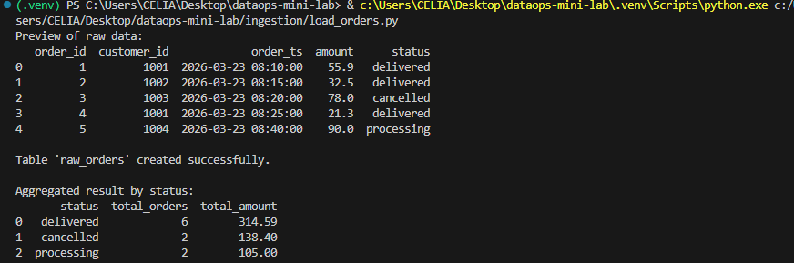

# DataOps Mini Lab

Pipeline simples de ingestão de pedidos em CSV utilizando Python, Pandas e DuckDB para disciplina de Data Ops



## Como rodar

```bash
python -m venv .venv
.\.venv\Scripts\Activate.ps1
pip install -r requirements.txt
python ingestion/load_orders.py